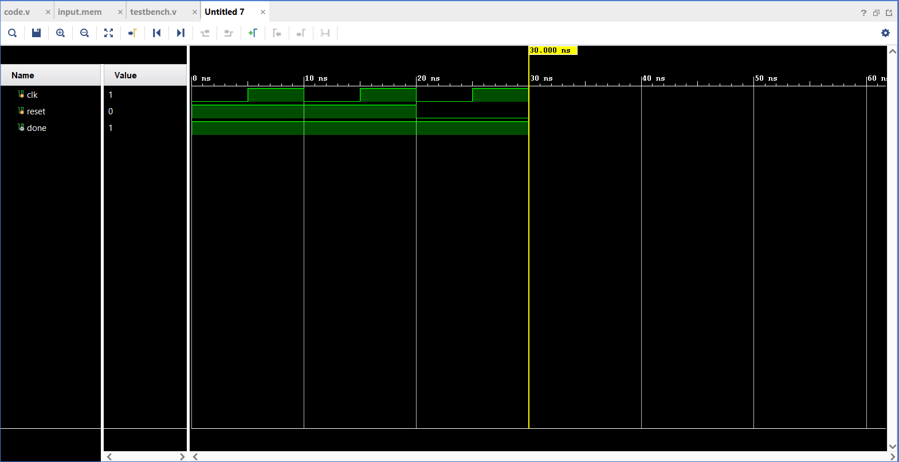
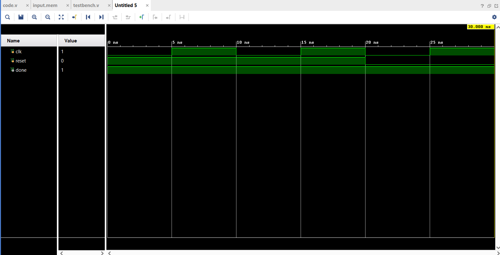
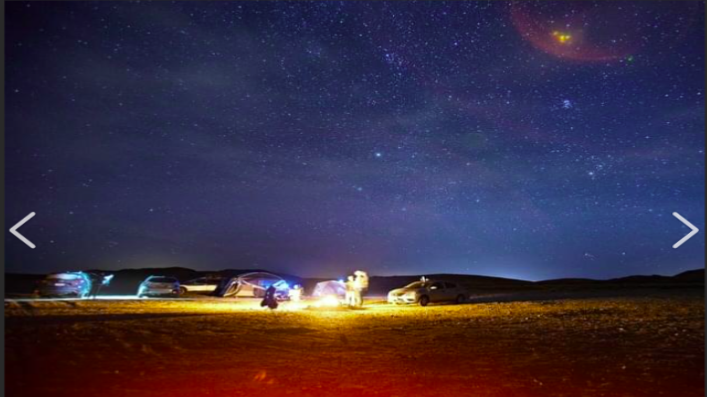

# SCALE-X: Fixed-Point Image Scaling in Verilog
### I-CHIP '26 | UDYAM '26 | Electronics Engineering Society

---

## Problem Statement
Implementation of a parameterized bilinear interpolation image scaling module in Verilog HDL that upscales a pre-stored image from 480×640 to 1080×1920 while supporting both grayscale and RGB formats.

---

## Implementation Overview

### Architecture
- Full-frame storage based architecture
- Input and output images stored as memory arrays (`reg [7:0]`)
- Bilinear interpolation computed procedurally using fixed-point arithmetic
- Supports both grayscale (1 channel) and RGB (3 channels) via `NO_OF_CHANNELS` parameter
- File I/O handled using `$readmemh` and `$writememh`

### Interpolation Formula
For each output pixel at (x_out, y_out):
```
 I00 = input_image[NO_OF_CHANNELS*(y0*W_IN + x0)+i];
 I10 = input_image[NO_OF_CHANNELS*(y0*W_IN + x1)+i];
 I01 = input_image[NO_OF_CHANNELS*(y1*W_IN + x0)+i];
 I11 = input_image[NO_OF_CHANNELS*(y1*W_IN + x1)+i];

               
sum =
 (( ( (1<<FP) - a ) * ( (1<<FP) - b ) * I00 ) +
 ( a * ( (1<<FP) - b ) * I10 ) +
 ( ( (1<<FP) - a ) * b * I01 ) +
 ( a* b * I11 )) >> (2*FP);

```

### Edge Handling
Boundary pixels are clamped to avoid out-of-bounds memory access:
```
x1 = (x0 + 1 < W_IN) ? x0 + 1 : x0;
y1 = (y0 + 1 < H_IN) ? y0 + 1 : y0;
```

---

## Parameters

| Parameter | Default | Description |
|---|---|---|
| `H_IN` | 480 | Input image height |
| `W_IN` | 640 | Input image width |
| `H_OUT` | 1080 | Output image height |
| `W_OUT` | 1920 | Output image width |
| `NO_OF_CHANNELS` | 1 or 3 | 1 = Grayscale, 3 = RGB |

---

## Project Structure
```
├── code.v          # Main Verilog design module
├── testbench.v     # Simulation testbench
├── img_to_mem.py   # Python script: image → input.mem
├── convert.py      # Python script: output.hex → output.png
└── README.md
```

---

## How to Run

### Step 1 — Generate input.mem from image
```bash
python img_to_mem.py
```
This converts your input PNG to a hex memory file (one pixel value per line).
- Grayscale: 307,200 lines (640×480×1)
- RGB: 921,600 lines (640×480×3)

### Step 2 — Copy input.mem to Vivado sources
Copy `input.mem` to your Vivado project sources folder and run simulation in Vivado.

### Step 3 — Run simulation in Vivado
- Open project in Vivado
- Click Run Simulation
- Wait for `done = 1` in waveform
- `output.hex` will be written automatically

### Step 4 — Convert output.hex to image

Opens `output.hex` and save the upscaled image as `output.png`.

---

## Simulation Waveform
RGB

Grayscale



| Signal | Behavior |
|---|---|
| `clk` | 10ns period clock |
| `reset` | Goes low at 20ns to start |
| `done` | Goes high at 30ns — output written |

---

## Results

| | Input | Output |
|---|---|---|
| Resolution | 640×480 | 1920×1080 |
| Format | Grayscale / RGB | Grayscale / RGB |
| Bit depth | 8-bit | 8-bit |

### Grayscale and RGB Result
| Grayscale output | RGB output |
|---|---|
|  |  |

---

## Tools Used
- Xilinx Vivado 2018.3 (Simulation)
- Python 3 with Pillow and NumPy (Image conversion)

---

## Constraints Followed
- No floating-point arithmetic in hardware logic
- No hardcoded output values
- Parameterized design supporting multiple resolutions
- Fixed-point integer arithmetic only
- `$readmemh` / `$writememh` used for file I/O
